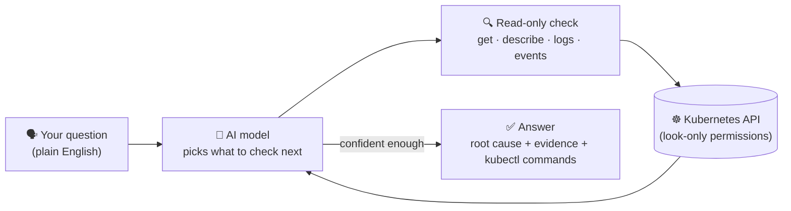

<div align="center">

# kubewhy

### Ask your Kubernetes cluster "why" — in plain English.

[](https://github.com/didiberman/kubewhy/actions/workflows/build.yml)
[](https://goreportcard.com/report/github.com/didiberman/kubewhy)
[](LICENSE)

**It investigates like a senior engineer. It can't break anything, ever. And it shows its work.**

</div>

---

## The 10-second pitch

Something's wrong in your cluster. Normally that means twenty minutes of
`kubectl get`, `describe`, `logs`, `events`, guessing, repeating.

kubewhy does that twenty minutes for you — you just ask it what's wrong,
in plain English:

```
$ kubewhy "why is checkout crashlooping in the prod namespace?"

kubewhy investigating: why is checkout crashlooping in the prod namespace?

  → checking events for "prod"                    (like: kubectl get events -n prod)
  → checking checkout's pod details                (like: kubectl describe pod ...)
  → checking its crash logs                        (like: kubectl logs ... --previous)

Answer
Root cause: OOMKilled. The app tries to use 300Mi of memory, but the pod's
limit is only 100Mi — so Kubernetes kills it every time it starts.

Fix: raise the memory limit to 300Mi or higher.
Verify it yourself: kubectl describe pod -n prod -l app=checkout
```

That's a real transcript from this repo's own demo cluster.

## Two ideas make this different from a typical AI tool

<table>
<tr>
<td width="50%" valign="top">

### 🔒 It physically cannot break anything

Most AI agents for infrastructure can also *change* things — deploy, scale,
delete. That's powerful, but it means every answer comes with "what if it's
wrong and acts on it?"

kubewhy skips that risk entirely. Think of it as an extremely
capable intern who's allowed to look at absolutely anything in the
building, but has **no hands** — they can open any door, read any file,
but cannot pick anything up.

Concretely: kubewhy connects to Kubernetes using a permission set that
only allows *look, don't touch* (`get`/`list`/`watch` — nothing else).
This isn't a promise the AI makes you — it's enforced by Kubernetes
itself. Even if the model completely lost its mind and tried to delete
your production database, Kubernetes would simply refuse, the same way a
locked door doesn't care how politely (or rudely) you ask.

That's why it's safe to point at production, mid-incident, without asking
anyone for permission first.

</td>
<td width="50%" valign="top">

### 🎓 It shows its work, like a good teacher

Most AI answers arrive as a finished paragraph — you either trust it or
you don't, and you learn nothing about *how* it got there.

kubewhy instead narrates itself in real time: *"checking crash logs
because the pod just restarted"* — followed by the plain old `kubectl`
command that does the same thing. The final answer includes those
commands too, so you could've done it yourself by hand.

The goal isn't to make `kubectl` obsolete. It's to make you faster at
it — every answer doubles as a small lesson.

</td>
</tr>
</table>

## How it works, in one picture



It's one small loop, repeated until the model has enough evidence to give
a confident answer. No installed operator, no custom resources, no
multi-agent framework — just a CLI, your kubeconfig, and a handful of
read-only checks.

Models come from [OpenRouter](https://openrouter.ai), so the brain behind
kubewhy is a runtime choice (`--model openai/gpt-5`, `--model
anthropic/claude-sonnet-4.5`, whatever you like) — never hard-coded.

## Don't want to ask? Watch mode does it for you

`kubewhy watch` turns the same read-only checks into a live dashboard — it
polls your cluster continuously, and the moment something looks broken it
investigates automatically in the background, no question required:

```
kubewhy watch  ·  read-only  ·  press q to quit

BROKEN
  ✗ prod/checkout-7cf7c94d78-7lzxs  (OOMKilled, 17 restarts)
      Root cause: The pod is OOMKilled — it tries to use ~300Mi but the
      container's memory limit is 100Mi.

WARNING
  ! staging/worker-9f8c  (2 restarts)
  ! prod/checkout-canary  (no resource requests set (breaks HPA / cluster-autoscaler sizing))

✓ 14 pod(s) healthy
```

A cheap, LLM-free check (`get pod` under the hood, no model calls) runs
every few seconds to classify every pod as healthy / warning / broken.
Only the ones that turn broken trigger the actual investigation loop — so
you're not burning a model call per pod per second, only on things that
are genuinely worth looking at.

That cheap check also catches things that never crash but quietly break
autoscaling — like a pod with no CPU/memory requests, which means the
HPA has nothing to compute a percentage against and Cluster Autoscaler /
Karpenter can't size a node for it. Those show as `WARNING` rather than
`BROKEN` since nothing is actively failing yet.

```bash
kubewhy watch                          # all namespaces
kubewhy watch --namespace prod         # just one
kubewhy watch --interval 10s           # poll less often
```

## Install

Pick whichever is easiest for you — all three get you the same single binary.

**One-line install (macOS/Linux):**

```bash
curl -sSL https://raw.githubusercontent.com/didiberman/kubewhy/main/install.sh | bash
```

**Via Go:**

```bash
go install github.com/didiberman/kubewhy/cmd/kubewhy@latest
```

**Download a prebuilt binary:** grab the archive for your OS/arch from the
[Releases page](https://github.com/didiberman/kubewhy/releases/latest).

**From source:**

```bash
git clone https://github.com/didiberman/kubewhy
cd kubewhy
go build -o bin/kubewhy ./cmd/kubewhy
```

Then:

```bash
export OPENROUTER_API_KEY=sk-or-...
kubewhy "why is my-pod in namespace default not ready?"
```

No Python, no virtualenv, no Docker required to run it — it's a single
compiled binary that talks to whatever cluster your `kubectl` currently
points at.

Want to see it catch a real, reproducible failure first? See [Demo](#see-it-catch-a-real-bug) below.

## Want the ironclad version?

By default kubewhy uses your own kubeconfig, whatever permissions that
carries. To make the "it literally cannot write" guarantee airtight —
useful for prod, a customer's cluster, or anywhere you want zero trust in
the AI's judgment — bind it to a locked-down account instead:

```bash
kubectl apply -f deploy/readonly-clusterrole.yaml
# generate a kubeconfig scoped to that account, then:
export KUBECONFIG=./kubewhy.kubeconfig
kubewhy "..."
```

## See it catch a real bug

This repo includes a script that reproduces a genuine failure so you can
watch kubewhy diagnose it, not take our word for it:

```bash
kind create cluster --name kubewhy-demo --config deploy/kind-config.yaml
kubectl apply -f deploy/demo-broken-app.yaml   # deliberately OOM-kills itself
kubewhy "why is the checkout deployment in the prod namespace crashlooping?"
```

## What it can diagnose today (v0.1)

- Crashing / not-ready pods (`get`, `describe`, `logs`, `events`)
- Namespace event timelines ("what's been happening here?")
- Basic CPU/memory pressure (via `kubectl top`, needs metrics-server)
- Pods with no resource requests set — silently breaks HPA and
  Cluster Autoscaler / Karpenter node sizing, caught automatically by
  `kubewhy watch`

More playbooks — cost spikes, network policy issues, "what changed since
yesterday" — are next. Contributions welcome; open an issue with the
scenario you want it to handle.

## FAQ

**Isn't this just kagent?** No — [kagent](https://github.com/kagent-dev/kagent)
is a framework for building agents that *act* on your cluster (deploy,
patch, scale). kubewhy is narrower on purpose: it only ever looks, never
touches, and ships as one binary instead of a platform to operate.

**Do I need to trust the AI model?** Only with information, never with
access. Worst case it gives you a wrong diagnosis — it can't make the
problem worse, because it has no way to change anything.

**Which models work?** Anything available on OpenRouter that supports
tool calling — Claude, GPT, Gemini, and most open-weight models.

## Contributing

Adding a new investigation tool? Keep it to a single
`get`/`list`/`watch`-shaped API call — that constraint is the entire
point of the project.

## License

MIT

